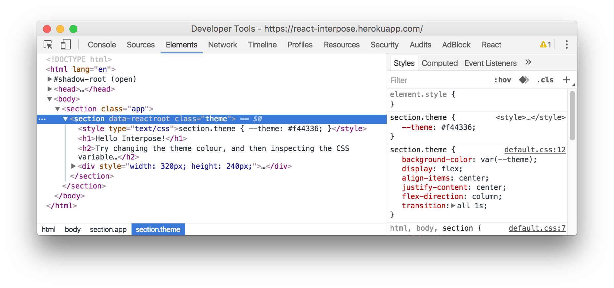

> Apply [stylesheet variables](https://developer.mozilla.org/en-US/docs/Web/CSS/Using_CSS_variables) to your React components for use in your stylesheets. Interpose reduces the clutter of React components by bridging the gap between JS and CSS without resorting to complicating your components with CSS logic.


&nbsp;

&nbsp;


* **npm:** `npm install react-interpose --save`



---

## Getting Started

```css
h1 {
    color: var(--colour);
}
```

By using the `map` property of the `StyleProperties` component &mdash; wrapping your component inside &mdash; the `--colour` variable can be dynamically applied with React:

```javascript
import StyleProperties from 'react-interpose';

const Component = props => {

    return (
        <StyleProperties map={{ colour: props.colour }}>
            <h1 className="header">
                Hello, Interpose!
            </h1>
        </StyleProperties>
    );

};
```

All of the `style` elements are placed alongside your component's markup. By default the <kbd>className</kbd> and <kbd>id</kbd> attributes are taken into consideration when generating the selector to house the CSS variables &mdash; however you can target `:root` &mdash; which is highly useful when used on conjunction with [Shadow DOM](https://developer.mozilla.org/en-US/docs/Web/Web_Components/Shadow_DOM) &mdash; by supplying `isRoot={true}` property to the `StyleProperties` component.

It's worth noting that any camel cased properties will be hyphenated &ndash; thus `colourTheme` will be transformed into `--colour-theme`.

## Advanced Usage

Interpose exports the `propsToStyles` function which allows you to pass in a map that yields a string of CSS variables. By using this function directly you can generate your own `style` element within your component:

```javascript
import { propsToStyles } from 'react-interpose';

export default props => {

    const styles = `
        h1.header {
            ${propsToStyles({ colour: props.colour })}
        }
    `;

    return (
        <h1 className="header">
        
            <style type="text/css">
                {styles}
            </style>
            
            Hello, Interpose!
            
        </h1>
    );

};
```

By using `propsToStyles` directly, you have greater control over the selector and the location of the `style` element.
